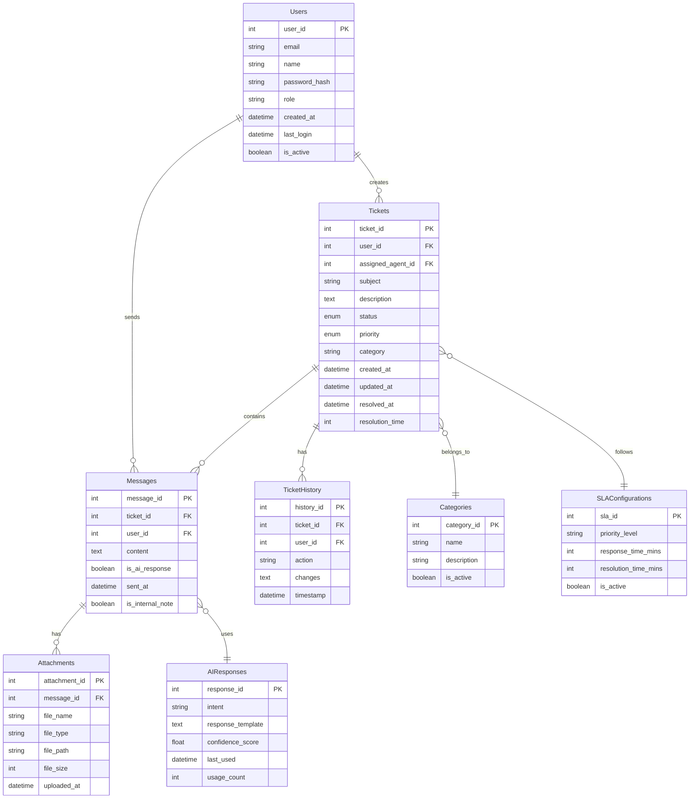

I'll create an ERD diagram showing the database structure for the Core Support Dashboard.

Let me explain the key components of this ERD:

1. Core Entities:
   - Users: Stores both customers and support agents
   - Tickets: Main ticket information
   - Messages: Communication within tickets
   - TicketHistory: Tracks all changes to tickets
   - Categories: Ticket categorization
   - SLAConfigurations: Service Level Agreement rules
   - AIResponses: AI chatbot response templates

2. Key Relationships:
   - Users can create multiple tickets and messages
   - Each ticket can have multiple messages and history entries
   - Messages can have multiple attachments
   - Tickets belong to specific categories and follow SLA configurations
   - Messages can be linked to AI responses

3. Important Fields:
   - Tracking fields (created_at, updated_at, etc.)
   - Status and priority enums for tickets
   - Flags for AI responses and internal notes
   - SLA tracking fields
   - User roles and permissions

4. Special Features:
   - Resolution time tracking
   - AI response confidence scoring
   - File attachment handling
   - SLA configuration management
   - Ticket history auditing

Would you like me to:
1. Add more detailed field specifications?
2. Include additional entities for specific features?
3. Expand on any particular relationship or entity?
